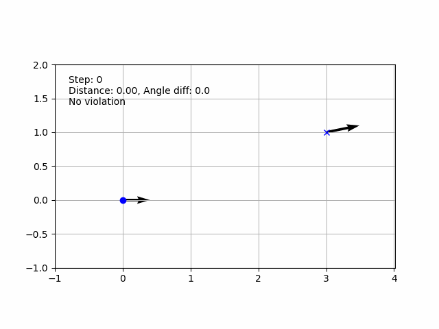
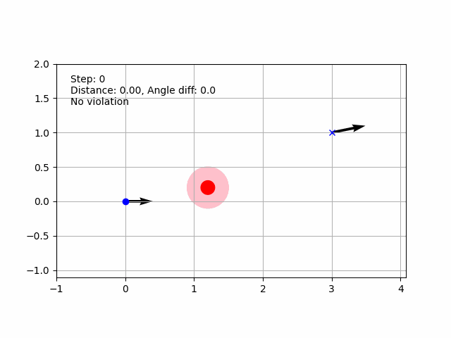
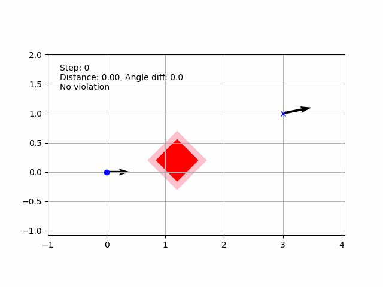
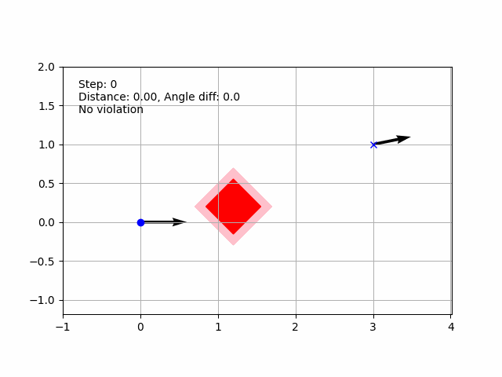

This course is prepared by Wojciech Domski.
All rights reserved.

# Task 1
Given provided example in *mpc.py* Python file provide implementation
for MPC algorithm, implementation of Unicycle model, and 
cost function implementation.

## MPC algorithm

To implement MPC algorithm focus on 
*MPC.run()* method. In this method a code block marked 
with TODO placeholder was provided. It contains 
6 steps which have to be filled. These steps are mainly 
responsible for collecting next evaluated step provided 
control input vector which was optimized using 
numerical optimization.

The entire template for MPC calculation was provided and 
it is only necessary to fill the gaps.

## Unicycle model
To implement unicycle model you can chose to implement 
pure kinematic model of the unicycle. No dynamic 
phenomenons at this stage have to be considered.

To implement the kinematic of unicycle you need to fill 
gaps inside *UnicycleModel.step()* method marked with 
a TODO tag.

## Cost function
The third and the last step is to finish the implementation of the 
cost function. The cost function does following. 
It iterates over control vector, evaluates the state of the model 
and calculates the cost. At this point please consider 
a simple cost function which 
takes into account only the distance to the goal position, 
and final orientation.

To accomplish above you need to add your code into 
*MPC.cost()* method. There are four steps. 
First three are considering only the goal pose, while 
the forth considers collision with obstacles. 
At this point please do not implement fourth step.

You need to evaluate nex state provided given control signals *u*.
After that you need to calculate distance from current robot 
position to the goal position. Also calculate angle difference 
between current robot's orientation and final orientation. Then, 
the distance and angle difference can be directly added 
to the cost. The overall cost should increase. You might 
need to use some positive coefficients to scale the distance and 
*absolute* angle difference.

Please omit the fourth step as mentioned earlier.

## Testing

Run the script using *run.py* method. 
You should observe some statistic showing number of step, current robot's position, etc.
After computation is finished a plot window will pop up showing 
robot's path.

## Results

At the end you should be able to achieve results similar to this



# Task 2

The scope of this task is to implement obstacles and 
consider them during cost calculation.

## Circular obstacle

You need to provide implementation for *Circle.distance()* method.
This method should calculate distance between center of the 
obstacle (self.center) and provided point *point*.

## Obstacle cost function

Now, it is time to finalize the fourth step inside cost function 
implementation. Please notice that while we iterate over control 
vector evolving robot's state there is a for loop. 
This for loop iterates over obstacles.
Your task is to provide implementation which would 
e.g. run inside() method to find out if the robot is 
in collision with the obstacle.

the inside() method returns tuple, first element 
of the tuple indicates if there was a collision, 
second gives distance to the center of the obstacle.

While implementing cost function dependant on 
obstacles please remember that the closer we get 
to an obstacle the higher should be the cost, thus 
cost it **inversely proportional** to the distance.

## Testing

Inside *run.py* you will find section **TODO obstacle**.
Uncomment the line which creates a Circle object 
like this one
```
obstacles.append(Circle(np.array([1.2, 0.2]), radius=0.1, safe_margin=0.2))
```

Does your robot avoids the obstacle?

In the visualization you can notice that if there is no 
collision the robot trace (dots) is blue, if there is 
high probability of the collision (within obstacle's safety margin)
the dots are yellow, if there is a imminent collision the 
dots are black.

## Results

After proper implementation of Circle obstacle 
and adding a term responsible for considering this obstacle 
in the cost function you should be able to get similar 
plots



Please notice violation of safety margin.

# Task 3

## Rectangular obstacles

Since we already have implementation of circular obstacles now we need to 
consider different shapes. Fill gaps inside *Rectangle.inside()* method.

**For simplified version of this task consider orientation always equal to 0 degrees.**

In order to test your solution 
inside *run.py* you will find section **TODO obstacle**.
Uncomment the line which creates a Rectangle object 
like this one
```
obstacles.append(Rectangle(np.array([1.2, 0.2]), width=0.5, height=0.5, orientationDeg=45, safe_margin=0.2))
```
for simplified version set *orientationDeg=0*.

Make sure to comment the circular obstacle.



Please notice the safety margin violation and 
obstacle collision.

## Ackerman model

Provide kinematic model of Ackerman vehicle representation.
Similar steps have to be repeated like for Unicycle model.
Find *AckermanModel* class and fill the gaps.



Please notice that now only the safety margin is violated.
