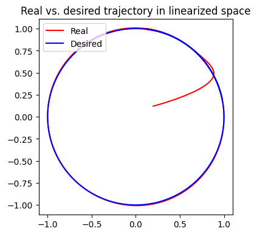
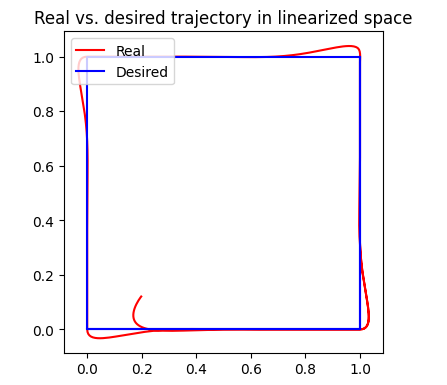
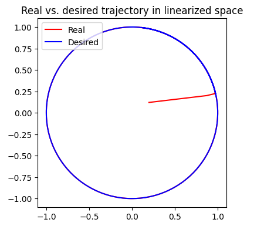
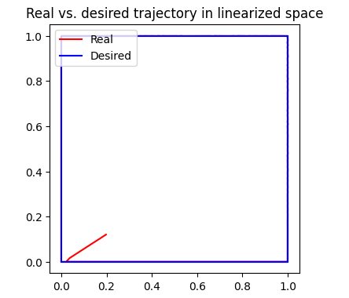

This course is prepared by Wojciech Domski.
All rights reserved.

# Task 1 -- just drive
Given provided example in *staticLin.py* Python file provide implementation
for static linearization algorithm, and implementation of Unicycle's dynamics.

## Static linearization algorithm

To implement static linearization algorithm focus on 
*SimulatorDynamics.step()* method. In this method a code block marked 
with TODO placeholder was provided. It contains 
steps which have to be filled. These steps are mainly 
responsible for dynamics calculation and control of a 
unicycle.

The entire template for static linearization calculation was provided and 
it is only necessary to fill the gaps.

During this task you need to implement everything but:
- desired trajectory represented as *trajectory_generator_circle*,
- control algorithm, including error calculation, *v* and *u*.

Apply a constant control signals equal to 0.1 for both wheels.

## Results

After a successful implementation the real trajectory 
should show a straight line because  
constant control signals were applied.

Change the initial pose (only orientation) to see if 
the real trajectory angle corresponds to the initial 
conditions

# Task 2 -- follow a circle

The scope of this task is to implement circular 
trajectory and control low.

## Circular trajectory

Finish implementation of *trajectory_generator_circle()* 
function by providing firs and second derivative. 
At this point do not change the provided *h* vector.

## Control law

Calculate the new signal *v* as PD controller with correction.
Calculate the control signal *u* based on the new input *v*.

## Results

Now, a desired trajectory should look like a circle. 
If the control algorithm was properly implemented 
the real (realized) trajectory should also be a circular 
in shape.

As initial condition use 
```
start = np.array([0.1, 0.1, np.pi/2*0.1, 0, 0])
```



# Task 3 -- follow a square

The task is to provide a desired square trajectory.
This can be implemented as a partially admissible 
trajectory consisting of admissible sections (straight) 
lines.

In *run.py* the following code has to be changed:
```
    # TODO chose trajectory generator
    trajectory_generator = trajectory_generator_circle
```
into
```
    # TODO chose trajectory generator
    trajectory_generator = trajectory_generator_square
```

Now, the *trajectory_generator_square()* function can be 
implemented inside *staticLin.py*.

## Results

Now, a desired trajectory should look like a square. 
Also, the real trajectory should look like a square.




# Task 4 -- just kinematics (additional task, not obligatory)

Similar to previous tasks but only kinematics is being considered.
For this purpose use *SimulatorKinematics* and its *step()* 
method to implement kinematics controller for a static linearization. 

Implement it both for circular trajectory and segment-wise admissible 
square trajectory.

Remember to select the right simulator (*kinematics simulator*) in *run.py* file.
In order to do so, replace
```
simulator = SimulatorDynamics
```
with
```
simulator = SimulatorKinematics
```



